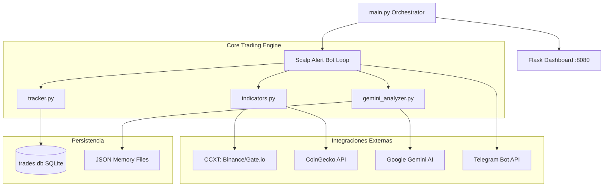

# 🏛️ Arquitectura del Scalp Alert Bot V1.6.3

El Scalp Alert Bot es un sistema de trading algorítmico híbrido diseñado para operar en entornos locales y en la nube (Replit), combinando análisis técnico tradicional con razonamiento avanzado de Inteligencia Artificial (Gemini 2.5 Flash).

## 🧩 Componentes Principales

### 1. Orquestador (`main.py`)
El punto de entrada del sistema. Utiliza `threading` para ejecutar simultáneamente:
- **Dashboard Web (Flask)**: Proporciona una interfaz para monitorear el estado y cumplir con el requisito de "Keep-Alive" de plataformas como Replit.
- **Bot de Telegram**: El motor de vigilancia que escanea precios y procesa comandos.

### 2. Motor de Vigilancia (`scalp_alert_bot.py`)
Contiene el bucle principal (`while True`) que:
1. Obtiene precios en tiempo real.
2. Calcula indicadores técnicos avanzados.
3. Evalúa múltiples estrategias (V1-TECH, V2-AI, V3-REVERSAL).
4. Gestiona el ciclo de vida de las operaciones (Apertura → Monitoreo TP/SL → Cierre).

### 3. Cerebro de IA (`gemini_analyzer.py`)
Implementa el "Consenso Híbrido". No solo valida señales técnicas, sino que mantiene una **memoria diaria persistente** segregada por personalidades (Conservador vs Scalper), permitiendo que el bot "aprenda" del comportamiento del mercado durante el día.

### 4. Matriz Técnica (`indicators.py`)
Responsable de toda la matemática financiera:
- RSI (15m, 1H).
- Bandas de Bollinger.
- EMA 200 (Tendencia macro).
- ATR (Average True Range) para gestión dinámica de riesgo.
- Conteo de Ondas de Elliott simplificado.

---

## 🛰️ Flujo de Operación

1.  **Ingesta**: El sistema descarga velas (OHLCV) de exchanges institucionales vía CCXT.
2.  **Procesamiento**: Se genera un "Score de Confluencia" (0-5).
3.  **Validación AI**: Si el score técnico es prometedor, se consulta a Gemini para confirmar o rechazar la entrada.
4.  **Ejecución**: Se envía una alerta enriquecida con gráficos y análisis a Telegram.
5.  **Tracking**: Cada operación se registra en `trades.db` para análisis post-mortem y estadísticas.

> [!TIP]
> El sistema está diseñado para ser "Resiliente". Si una fuente de precios (ej. Binance) falla, tiene un fallback automático hacia CoinGecko para asegurar la continuidad.
